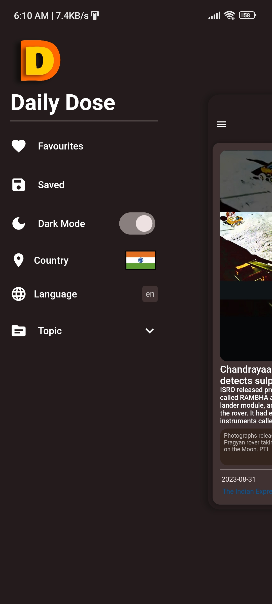
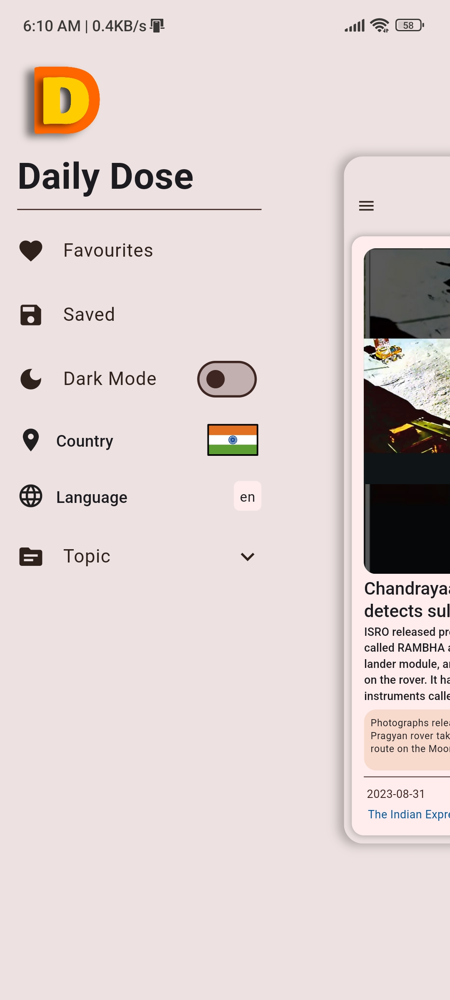

# dailydose

> This is a news app build in flutter, gives the sort news description with an image and upon clicking it's description it opens the news article from the original source.


⭐ Star us on GitHub — it helps!

### [Live Preview](https://dailydose-eosin.vercel.app/)





## Features 📚

* News feeds
* Filter based on topic 
* Filter news based on Country
* Filter news based on Language
* Search for any news
* Save news in local as `favourite` or `save for later`
* Proper Error Handling
* All config are stored locally using Shared pref
* Dark mode and light mode
* Custom class coloredLog is used to print the results and request as colored text

### Packages Used
* [flutter_svg](https://pub.dev/packages/flutter_svg)
* [http](https://pub.dev/packages/http)
* [provider](https://pub.dev/packages/provider)
* [url_launcher](https://pub.dev/packages/url_launcher)
* [flutter_share](https://pub.dev/packages/flutter_share)
* [shared_preferences](https://pub.dev/packages/shared_preferences)
* [flutter_zoom_drawer](https://pub.dev/packages/flutter_zoom_drawer)

## Project setup 📋

- This news app is built on `Flutter` and that's why we need `flutter` and `dart` installed
- After the successful installation and setup of `flutter`, clone the repository into your local system using below command:

 ```properties
   git clone https://github.com/thisisprabhat/dailydose.git
 ```
This will clone the whole repository in your system.

- Then run `flutter pub get` to get the packages listed in the `pubspec.yaml` file.
- This project uses a news api form gnews.com, so we need to get an api key and include it in the project in `lib/constants/api_key.dart`
```dart
const String kApiKey = "ENTER YOUR OWN API KEY FROM [https://gnews.io]";
```
- Now the project is ready to use

### Pending
* Responsive ui for web and desktop
* Localization
